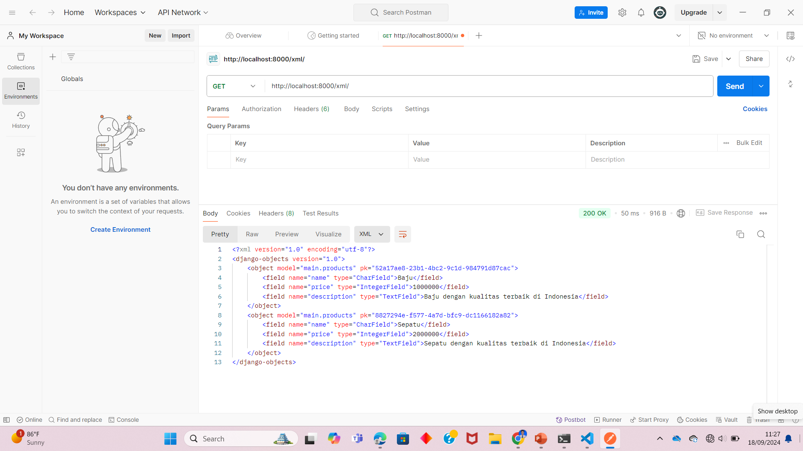
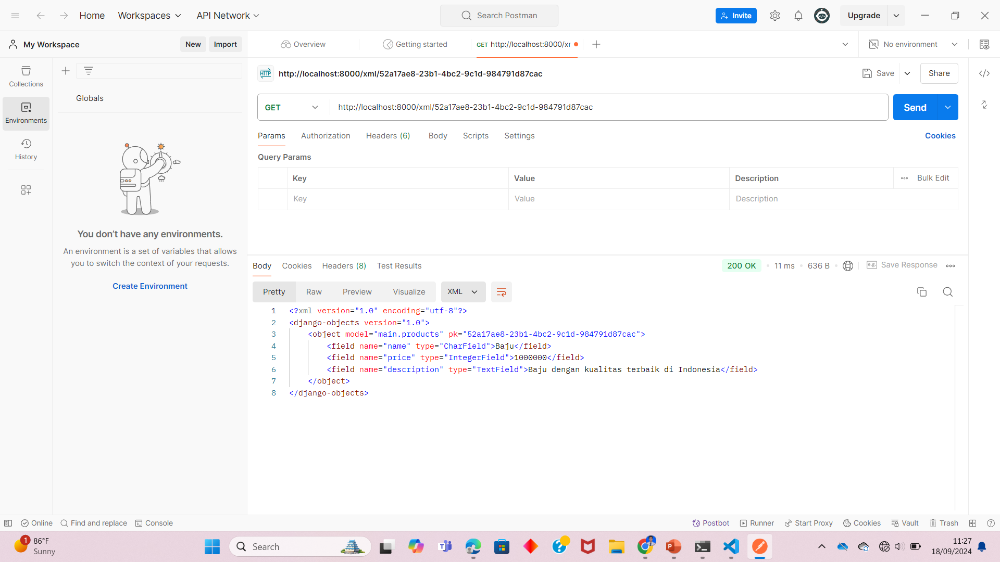
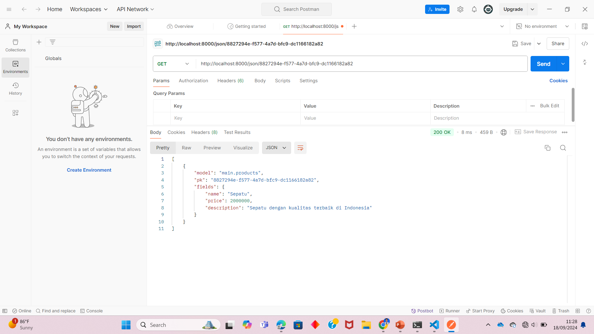
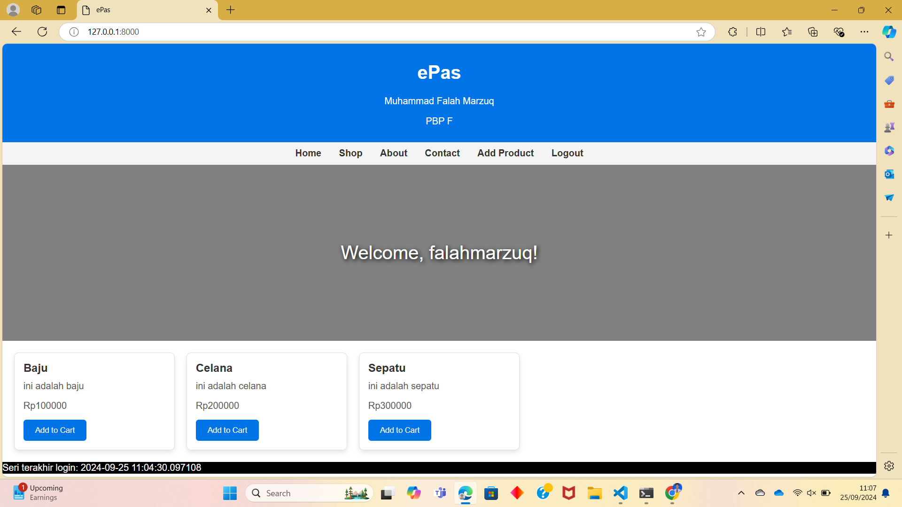
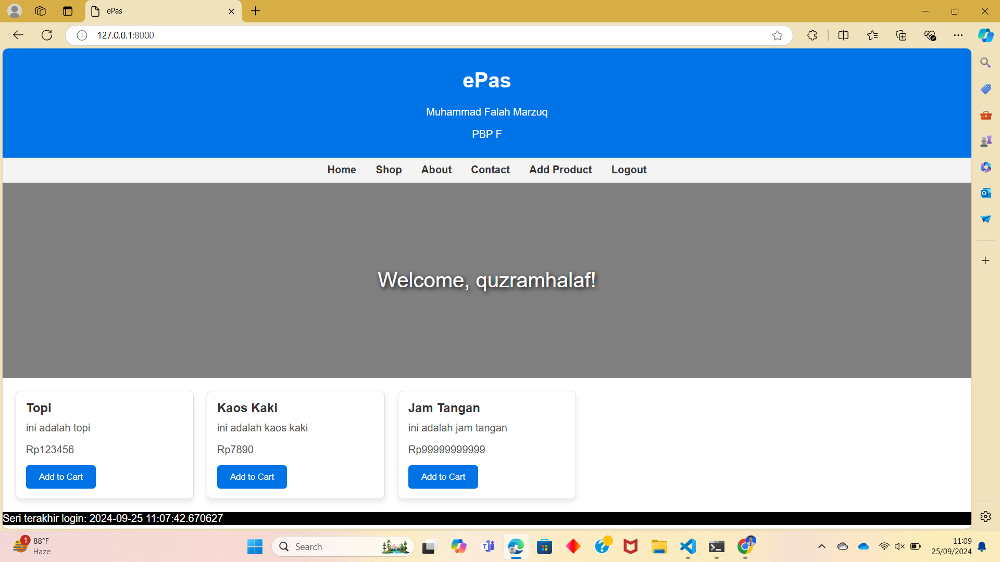

## Tugas 2
http://muhammad-falah-epas.pbp.cs.ui.ac.id/

**Langkah-langkah pembuatan:**
1. Membuat folder tugas 2 yang akan menjadi direktori utama dari proyek
2. Melakukan inisiasi git pada folder tersebut (menjalankan command git init)
3. Membuat repository baru di github dan menjalankan command git remote add origin <URL repository ini>
4. Membuat virtual environment untuk mengisolasi proyek
5. Menginstalasi django dan dependencies lainnya dalam requirements.txt, menambahkan file .gitignore melakukan startproject, menambahkan allowed hosts, dan membuat proyek baru di pws
6. Menambahkan direktori main pada direktori utama dengan command python manage.py startapp main
7. Menambahkan direktori template di dalamnya yang berisi file html yang merupakan tampilan dari websitenya
8. Menambahkan file models.py dengan atribut name, price, dan description
9. Menambahkan fungsi show_main di dalam views.py yang berisi nilai dari masing-masing atribut
10. Menambahkan path di urls.py dalam direktori utama dan direktori main yang akan menampilkan halaman utama website
11. Melakukan push ke github dan pws

**Apa fungsi git dalam pengembangan perangkat lunak?**
Git adalah sistem kontrol versi terdistribusi yang banyak digunakan dalam pengembangan perangkat lunak. Git memungkinkan pengembang untuk melacak perubahan pada kode sumber dari waktu ke waktu. Setiap perubahan dicatat sehingga pengembang dapat kembali ke versi sebelumnya jika diperlukan.

**Mengapa Django dijadikan permulaan pembelajaran pengembangan perangkat lunak?**
Django mengikuti prinsip "Convention over Configuration", yang berarti banyak keputusan umum sudah dibuat untuk Anda, memungkinkan pengembang fokus pada pengembangan fitur. Django juga menggunakan arsitektur MVT yang memisahkan logika bisnis dari tampilan, sehingga memudahkan pengembangan dan pemeliharaan kode.

**Mengapa Django disebut ORM?**
Django disebut ORM (Object-Relational Mapping) karena framework ini menyediakan mekanisme yang memungkinkan pengembang berinteraksi dengan basis data menggunakan objek-objek python sebagai pengganti penulisan perintah SQL secara langsung. Dengan Django ORM, setiap tabel dalam database direpresentasikan sebagai kelas model Python, dan setiap baris dalam tabel tersebut diwakili sebagai instansi objek dari kelas tersebut.

## Tugas 3
**Mengapa kita memerlukan data delivery dalam pengimplementasian sebuah platform?**
data delivery merupakan pengiriman data berupa file ke pengguna lain atau dengan mengirimkannya ke web yang dapat diakses. Pengimplementasian data delivery yang baik dapat mengoptimalkan pengguna dalam mengakses data dengan cepat dan tepat sehingga mendukung interkasi pengguna dengan platform. Keamanan juga menjadi faktor penting, di mana data delivery yang aman melindungi dari risiko kebocoran atau akses yang tidak sah. Dengan pengiriman data yang baik, platform juga lebih mudah diskalakan untuk menangani peningkatan jumlah pengguna dan beban kerja tanpa mengorbankan kinerja.

**Menurutmu, mana yang lebih baik antara XML dan JSON? Mengapa JSON lebih populer dibandingkan XML?**
Menurut saya, secara umum, JSON lebih baik dibandingkan dengan XML. JSON memiliki sintaks yang lebih sederhana sehingga lebih mudah dibaca dan dipahami oleh manusia dan lebih efisien untuk diproses oleh mesin. Struktur data yang digunakan JSON sudah sesuai dengan banyak bahasa pemrograman sehingga datanya lebih mudah dimanipulasi. Sementara itu, XML memiliki struktur yang lebih kompleks dengan tag pembuka dan penutup yang menambah beban kode untuk diproses. Namun, hal tersebut menyebabkan XML lebih fleksibel untuk data yang sangat terstruktur atau memerlukan metadata tambahan. Akan tetapi, JSON lebih unggul dalam hal kecepatan, efisiensi, dan kemudahan penggunaan.

**Jelaskan fungsi dari method is_valid() pada form Django dan mengapa kita membutuhkan method tersebut?**
Method is_valid() pada form digunakan untuk memeriksa apakah data yang dikirim melalui form memenuhi semua kriteria validasi yang telah ditentukan. Method tersebut akan memeriksa apakah semua field dalam form diisi sesuai dengan tipe data yang diharapkan dan aturan validasi yang telah ditentukan. Jika semua validasi terpenuhi, maka method ini akan mengembalikan nilai True. Jika ada kesalahan atau data yang tidak valid, maka method ini akan mengembalikan False. Selain memastikan kebenaran dari data yang diinput agar sesuai dengan model yang telah kita buat, method ini juga berguna untuk menjaga keamanan aplikasi kita. Data yang tidak valid atau berbahaya dapat menyebabkan kesalahan pada aplikasi atau membuka celah keamanan.

**Mengapa kita membutuhkan csrf_token saat membuat form di Django? Apa yang dapat terjadi jika kita tidak menambahkan csrf_token pada form Django? Bagaimana hal tersebut dapat dimanfaatkan oleh penyerang?**
Kita membutuhkan csrf_token saat membuat form di Django untuk melindungi aplikasi dari serangan Cross-Site Request Forgery (CSRF). CSRF adalah serangan di mana penyerang dapat memaksa pengguna yang telah terautentikasi di suatu aplikasi web untuk mengirimkan permintaan yang tidak diinginkan ke server, tanpa sepengetahuan atau persetujuan pengguna. csrf_token adalah token keamanan unik yang dihasilkan oleh server dan ditambahkan ke setiap form yang diajukan. Ketika form dikirim, token ini dikirimkan bersama data form dan diverifikasi oleh server untuk memastikan bahwa permintaan tersebut sah dan berasal dari aplikasi yang diharapkan, bukan dari situs pihak ketiga yang mencoba menyalahgunakan sesi pengguna. Jika kita tidak menambahkan csrf_token pada form, aplikasi menjadi rentan terhadap serangan CSRF. Penyerang dapat mengambil tindakan yang tidak sah atas nama pengguna, seperti mengubah data, melakukan transaksi, atau bahkan menghapus akun. Seorang penyerang dapat memanfaatkan ketiadaan csrf_token membuat sebuah halaman yang berisi form tersembunyi yang mengirimkan permintaan POST ke aplikasi target. Jika pengguna membuka halaman tersebut saat mereka sedang login di aplikasi target, server akan menganggap permintaan tersebut sah, dan penyerang dapat memanipulasi data pengguna tanpa disadari.

**Berikut merupakan gambar xml dan json yang menampilkan objek yang telah dibuat:**

**Langkah-Langkah Pengimplementasian Tugas 3:**
1. Menambahkan base.html di dalam folder templates pada direktori utama yang dijadikan sebagai kerangka untuk template html untuk aplikasi main
2. Menambahkan baris 'DIRS': [BASE_DIR / 'templates'] di dalam variabel TEMPLATES pada file settings.py
3. Membuat model baru di dalam models.py, yaitu Accounts, yang akan digunakan untuk menyimpan data dari form yang akan dibuat
3. Mengubah primary key dari setiap objek model yang dibuat dari tipe data integer menjadi UUID
4. Membuat file forms.py di dalam direktori main berupa form untuk menambah product
5. Membuat fungsi baru di dalam views.py, yaitu create_accounts, yang akan mengarahkan pengguna ke form add product
6. Menambahkan path url untuk formnya ke variabel urlpatterns yang berada di urls.py di main
7. Menambahkan file html baru yang digunakan sebagai tampilan dari formnya
8. Melakukan modifikasi pada file main.html untuk menampilkan semua product baru yang telah ditambahkan

## Tugas 4
**Apa perbedaan antara** `HttpResponseRedirect()` **dan** `redirect()`
`HttpResponseRedirect()` adalah kelas yang digunakan untuk melakukan redirect dengan mengembalikan respons HTTP status 302 (Moved Temporarily). Kelas ini biasanya digunakan untuk mengarahkan pengguna ke URL yang diberikan dan hanya menerima satu argumen, yaitu URL tujuan (string URL absolut atau relatif). Sementara itu, `redirect()` merupakan fungsi  shortcut yang lebih mudah dan fleksibel daripada HttpResponseRedirect() karena redirect() bisa menerima beberapa tipe argumen tambahan seperti nama model, view, dan URL.

**Bagaimana cara kerja penghubungan model Product dengan User**
Di dalam model Product, terdapat kolom ForeignKey yang berisi referensi dari suatu objek User. Suatu User dapat dihubungkan ke banyak Product tetapi suatu objek Product hanya dapat memiliki satu objek User yang dihubungkannya. Hal ini dapat dicapai dengan menambahkan `user = models.ForeignKey(User, on_delete=models.CASCADE)` pada model Product. Jika suatu objek User dihapus, semua objek Product yang memiliki ForeignKey dari User terebut juga akan dihapus.

**Apa perbedaan antara authentication dan authorization, apakah yang dilakukan saat pengguna login? Jelaskan bagaimana Django mengimplementasikan kedua konsep tersebut.**
Authentication merupakan proses memverifikasi identitas pengguna yang ingin mengakses suatu web. Pengguna akan diminta untuk memberikan kredensialnya, seperti username dan password, yang kemudian akan dicocokkan dengan data yang ada dalam database. Jika kredensial benar, pengguna dianggap sebagai pengguna yang sah, dan proses autentikasi berhasil. Sementara itu, authorization adalah proses untuk menentukan apa yang dapat dan tidak dapat dilakukan oleh pengguna yang telah diautentikasi. Setelah pengguna terverifikasi identitasnya, otorisasi mengontrol akses pengguna tersebut terhadap sumber daya, fitur, atau tindakan tertentu. Contoh pengimplementasian authentication dan authorization dalam Django adalah dengan penggunaan fungsi `authenticate(), login(), logout()` atau kelas `AuthenticationForm` untuk mengelola verifikasi pengguna dan decorators seperti `login_required` dan `permission_required` untuk membatasi hak akses suatu pengguna.

**Bagaimana Django mengingat pengguna yang telah login? Jelaskan kegunaan lain dari cookies dan apakah semua cookies aman digunakan?**
Django mengingat pengguna yang telah login melalui mekanisme session dan cookies. Saat pengguna berhasil login, Django membuat session yang disimpan baik di server maupun di browser pengguna dalam bentuk cookie. Proses ini memungkinkan Django untuk mengidentifikasi pengguna dan menjaga status login mereka di antara permintaan (requests) yang berbeda. Setiap kali pengguna mengirim request baru (misalnya membuka halaman lain di aplikasi), browser akan mengirimkan cookie tersebut ke server. Django menggunakan session ID dalam cookie untuk mencari informasi session yang terkait dan memastikan bahwa pengguna tersebut sudah login. Selain menyimpan session ID untuk mempertahankan status pengguna, cookies juga sering digunakan untuk menyimpan preferensi pengguna seperti tema, bahasa, atau pengaturan tampilan serta menyimpan informasi yang membantu situs web menampilkan konten yang relevan, seperti daftar barang yang terakhir dilihat di situs e-commerce.

**Langkah-Langkah Pengimplementasian Tugas 4:**
1. Melakukan import `UserCreationForm` dan `messages` kemudian menambahkan fungsi `register` dalam `views.py` sebagai fungsi yang akan mengarahkan pengguna ke halaman register untuk membuat akun baru. Halaman akan menampilkan pesan berhasil jika pengguna berhasil membuat akun.
2. Menambahkan file `register.html` dalam direktori templates di main yang merupakan tampilan dari halaman untuk mendaftar akun.
3. Menambahkan path url fungsi `register` ke urlpatterns di dalam `urls.py`.
4. Melakukan import `AuthenticationForm, login, logout` kemudian menambahkan fungsi `login_user` sebagai fungsi yang akan mengarahkan pengguna ke halaman login untuk melakukan autentikasi pengguna dan fungsi `logout` untuk keluar dari halaman web.
5. Menambahkan file `login.html` dalam direktori templates di main yang merupakan tampilan dari halaman untuk login.
6. Menambahkan tombol untuk logout di dalam file `main.html` agar terdapat opsi untuk logout di tampilan utama web
6. Menambahkan path url fungsi `login_user` dan `logout` ke urlpatterns di dalam `urls.py`.
7. Melakukan restriksi halaman untuk web sehingga pengguna harus melakukan login terlebih dahulu dengan menggunakan decorator `login_required` yang ditambahkan di atas fungsi `show_main`.
8. Menampilkan data dari cookie melalui variabel `last_login` yang telah diatur di dalam fungsi `login_user`. Variabel ini kemudian ditambahkan ke variabell `context` yang terdapat dalam fungsi `show_main` agar dapat ditampilkan pada halaman utama web berupa waktu login terakhir. Data cookie ini kemudian akan dihapus saat user melakukan logout dengan menambahkan `response.delete_cookie('last_login')`.
9. Menghubungkan model Product dengan User melalui penerapan ForeignKey. Hal ini dapat dilakukan dengan baris `user = models.ForeignKey(User, on_delete=models.CASCADE)`. Saat suatu objek User menambahkan Product, objek tersebut kemudian akan menyimpan ForeignKey dari User yang bersesuaian. Saat objek Usernya dihapus, objek-objek Product yang berkaitan akan dihapus juga.
10. Menampilkan Product yang ditambahkan oleh User dengan menambahkan `products = Products.objects.filter(user=request.user)` yang kemudian ditambahkan ke dalam variabel `context` agar dapat ditampilkan ke halaman utama web melalui template `main.html`.
11. Mempersiapkan aplikasi web untuk environment production dengan `import os` dan mengganti variabel `DEBUG` menjadi `PRODUCTION = os.getenv("PRODUCTION", False)` dan `DEBUG = not PRODUCTION`.

**Berikut merupakan gambar halaman untuk dua user dengan produk yang berbeda:**

## Tugas 5
**Jika terdapat beberapa CSS selector untuk suatu elemen HTML, jelaskan urutan prioritas pengambilan CSS selector tersebut!**
Dalam CSS, ketika beberapa selector ditetapkan untuk elemen yang sama, prioritas pengambilan ditentukan oleh *specificity* (spesifisitas) dan aturan *cascading* (pengurutan). Urutan prioritas CSS selector dihitung berdasarkan tipe selektor yang digunakan. Selektor dengan *inline styles* (gaya langsung pada elemen) memiliki prioritas tertinggi. Selanjutnya adalah selektor dengan ID, yang dihitung lebih spesifik dibandingkan selektor kelas, pseudo-class, dan atribut, yang berada di level kedua. Selektor elemen HTML dan pseudo-element, seperti `p` atau `::before`, memiliki prioritas lebih rendah. Jika beberapa aturan memiliki *specificity* yang sama, yang ditetapkan terakhir dalam urutan kode (bawah) akan digunakan karena sifat *cascading* CSS. Selain itu, penggunaan kata kunci `!important` dapat mengesampingkan aturan lainnya, meskipun *specificity* lebih rendah. Namun, jika beberapa aturan memiliki `!important`, maka urutan *specificity* akan berlaku lagi di antara mereka.

**Mengapa responsive design menjadi konsep yang penting dalam pengembangan aplikasi web? Berikan contoh aplikasi yang sudah dan belum menerapkan responsive design!**
Responsive design menjadi konsep yang penting dalam pengembangan aplikasi web karena memungkinkan situs atau aplikasi web untuk beradaptasi dengan berbagai ukuran layar dan perangkat, seperti ponsel, tablet, dan desktop. Hal ini meningkatkan pengalaman pengguna (user experience) dengan memastikan tampilan yang konsisten dan fungsional terlepas dari perangkat yang digunakan. Dengan semakin banyaknya variasi perangkat dan resolusi layar, responsive design membantu memastikan bahwa situs tetap mudah dibaca, diakses, dan dinavigasi di semua perangkat. Selain itu, desain yang responsif juga berdampak positif pada SEO, karena Google memberikan peringkat lebih tinggi untuk situs yang dioptimalkan untuk perangkat seluler.
Contoh aplikasi yang sudah menerapkan responsive design adalah YouTube dan Twitter. Kedua platform ini menyesuaikan tata letaknya dengan baik di berbagai perangkat, dari desktop hingga smartphone, memastikan pengalaman yang konsisten dan intuitif bagi pengguna. Sementara itu, contoh website yang belum menerapkan responsive design di UI adalah website siak.ng. Website ini memiliki tampilan yang sama di desktop maupun handphone.

**Jelaskan perbedaan antara margin, border, dan padding, serta cara untuk mengimplementasikan ketiga hal tersebut!**
Margin, border, dan padding adalah tiga properti dalam CSS yang digunakan untuk mengatur jarak dan tata letak elemen pada halaman web. Margin adalah ruang di luar elemen yang memisahkannya dari elemen lain. Ini menciptakan jarak antara elemen yang berdekatan. Border adalah garis yang mengelilingi elemen, berada di antara margin dan padding. Border dapat diatur ketebalan, gaya, dan warnanya, memberikan batas visual di sekitar elemen. Padding adalah ruang di dalam elemen, antara konten elemen dan border-nya. Padding digunakan untuk menambah ruang di dalam elemen tanpa mengubah ukuran kontennya.

**Jelaskan konsep flex box dan grid layout beserta kegunaannya!**
Flexbox dan Grid layout adalah dua metode layout modern dalam CSS yang digunakan untuk mengatur dan mendesain elemen dalam halaman web secara lebih fleksibel dan responsif. Flexbox (Flexible Box Layout) digunakan untuk menyusun elemen dalam satu dimensi, baik itu secara horizontal (row) atau vertikal (column). Flexbox sangat berguna ketika ingin membuat tata letak yang responsif dan mudah beradaptasi dengan ruang yang tersedia. Elemen dalam flexbox dapat diratakan, direntangkan, atau diposisikan dengan fleksibel, sehingga sangat ideal untuk tata letak yang membutuhkan distribusi elemen yang dinamis.
Di sisi lain, Grid layout menyediakan sistem dua dimensi untuk tata letak web, memungkinkan penempatan elemen dalam baris dan kolom secara bersamaan. Grid cocok untuk desain yang lebih kompleks dan terstruktur, seperti membagi halaman menjadi beberapa bagian dengan ukuran yang tetap atau fleksibel. Dengan grid, pengembang dapat mendefinisikan template layout yang lebih teratur dan simetris, yang membuatnya ideal untuk layout halaman yang lebih besar dan terencana, seperti dashboard atau halaman beranda.

**Langkah-Langkah Pengimplementasian Tugas 5:**
1. Membuat fungsi `edit_product` dalam views.py yang digunakan untuk mengedit informasi suatu produk yang telah dibuat user.
2. Membuat fungsi `delete_product` dalam views.py yang digunakan untuk menghapus produk yang telah dibuat user
3. Menambahkan path URL kedua fungsi tersebut ke dalam `urlpatterns` di urls.py
4. Menambahkan tombol edit dan delete pada setiap product card di main.html
5. Membuat */navigation bar*/ yang lebih */responsive*/ sehingga tampilan dari halaman utama websitenya di desktop akan berbeda dengan tampilan websitenya di mobile. Hal ini dapat dilakukan dengan pengimplementasian elemen `<script>` dan juga pengimplementasian */responsive media queries*/ yaitu `@media`.

## Tugas 6
**Jelaskan manfaat dari penggunaan JavaScript dalam pengembangan aplikasi web!**
JavaScript adalah bahasa pemrograman yang sangat penting dalam pengembangan aplikasi web karena memberikan interaktivitas dan dinamika pada halaman web. Dengan JavaScript, pengembang dapat menciptakan pengalaman pengguna yang lebih baik melalui manipulasi DOM, mengubah konten secara real-time, dan merespons tindakan pengguna tanpa memerlukan muatan ulang halaman. Selain itu, JavaScript memungkinkan pengembangan aplikasi satu halaman (Single Page Application atau SPA), di mana pengguna dapat menjelajahi berbagai bagian aplikasi tanpa harus memuat ulang seluruh halaman.

**Jelaskan fungsi dari penggunaan await ketika kita menggunakan fetch()! Apa yang akan terjadi jika kita tidak menggunakan await?**
Penggunaan await dalam konteks fetch() di JavaScript berfungsi untuk menunggu penyelesaian promise sebelum melanjutkan eksekusi kode di bawahnya. Ketika kita melakukan permintaan jaringan menggunakan fetch(), yang mengembalikan sebuah promise, menggunakan await akan menghalangi eksekusi kode lebih lanjut hingga respons dari permintaan tersebut diterima. Tanpa menggunakan await, kode akan terus dieksekusi tanpa menunggu respons, yang bisa menyebabkan masalah, seperti mencoba mengakses data yang belum tersedia atau menjalankan logika yang bergantung pada hasil dari permintaan tersebut.

**Mengapa kita perlu menggunakan decorator csrf_exempt pada view yang akan digunakan untuk AJAX POST?**
Decorator csrf_exempt digunakan pada view yang menerima permintaan POST dari AJAX untuk menonaktifkan perlindungan CSRF (Cross-Site Request Forgery) pada endpoint tertentu. Dalam aplikasi Django, perlindungan CSRF adalah fitur keamanan yang mencegah serangan dari pihak ketiga yang mencoba mengirimkan permintaan yang tidak sah. Namun, ketika menggunakan AJAX untuk mengirimkan data, kita seringkali tidak dapat secara otomatis menyertakan token CSRF yang diperlukan. Dengan menambahkan decorator csrf_exempt, kita dapat dengan aman mengizinkan permintaan POST ke view tersebut tanpa memeriksa token CSRF.

**Pada tutorial PBP minggu ini, pembersihan data input pengguna dilakukan di belakang (backend) juga. Mengapa hal tersebut tidak dilakukan di frontend saja?**
Pembersihan data input pengguna di backend sangat penting meskipun sudah ada validasi di frontend. Meskipun validasi di frontend dapat memberikan umpan balik cepat kepada pengguna, ia tidak dapat diandalkan sepenuhnya untuk melindungi aplikasi dari data yang tidak valid atau berbahaya. Pengguna dapat dengan mudah memanipulasi atau mengabaikan validasi frontend, sehingga memungkinkan data berbahaya untuk dikirim ke server. Dengan melakukan pembersihan data input di backend, kita memastikan bahwa semua data yang diterima dari pengguna diperiksa dan dibersihkan dari potensi ancaman, seperti injeksi SQL atau skrip lintas situs (XSS).