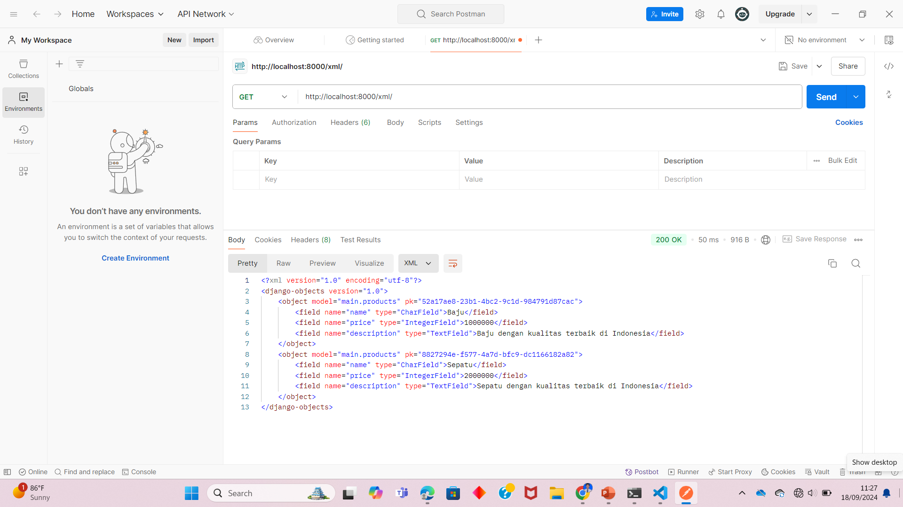
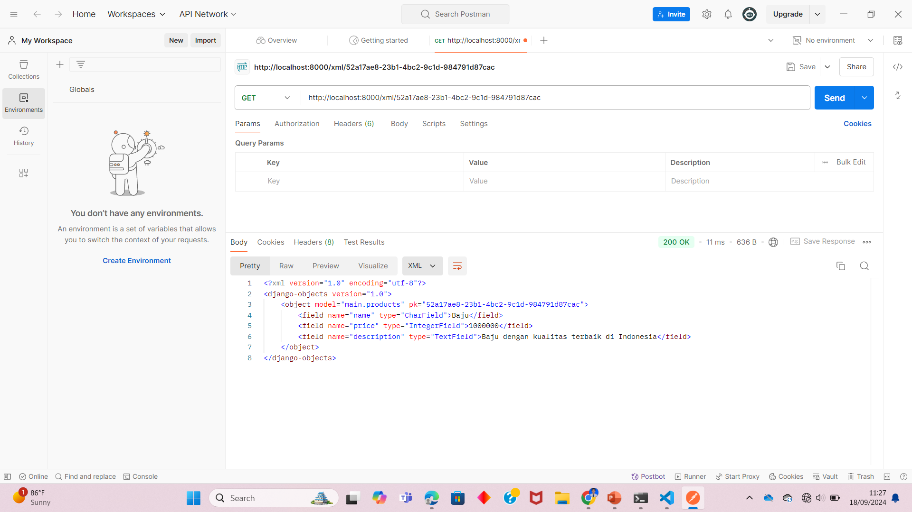
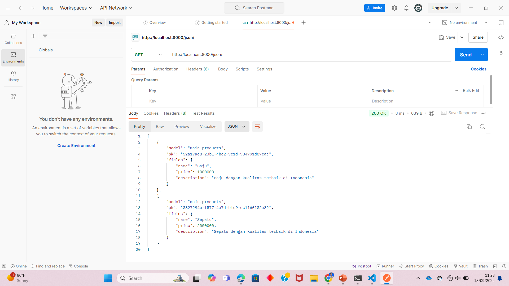
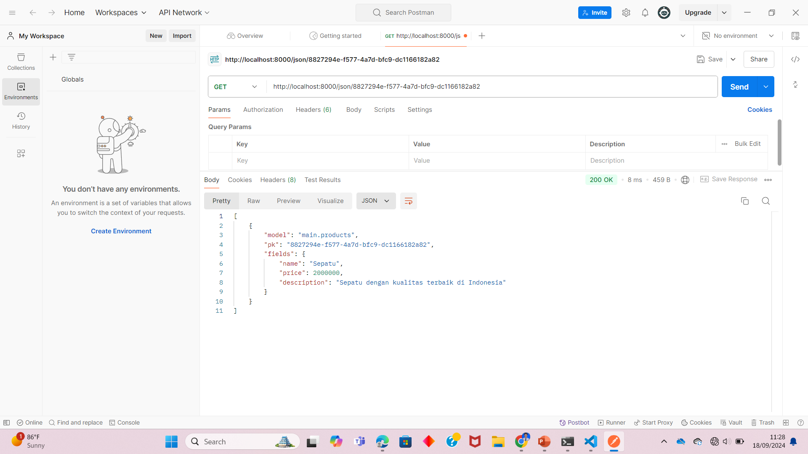

## Tugas 1
http://muhammad-falah-epas.pbp.cs.ui.ac.id/

**Langkah-langkah pembuatan:**
1. Membuat folder tugas 2 yang akan menjadi direktori utama dari proyek
2. Melakukan inisiasi git pada folder tersebut (menjalankan command git init)
3. Membuat repository baru di github dan menjalankan command git remote add origin <URL repository ini>
4. Membuat virtual environment untuk mengisolasi proyek
5. Menginstalasi django dan dependencies lainnya dalam requirements.txt, menambahkan file .gitignore melakukan startproject, menambahkan allowed hosts, dan membuat proyek baru di pws
6. Menambahkan direktori main pada direktori utama dengan command python manage.py startapp main
7. Menambahkan direktori template di dalamnya yang berisi file html yang merupakan tampilan dari websitenya
8. Menambahkan file models.py dengan atribut name, price, dan description
9. Menambahkan fungsi show_main di dalam views.py yang berisi nilai dari masing-masing atribut
10. Menambahkan path di urls.py dalam direktori utama dan direktori main yang akan menampilkan halaman utama website
11. Melakukan push ke github dan pws

**Apa fungsi git dalam pengembangan perangkat lunak?**
Git adalah sistem kontrol versi terdistribusi yang banyak digunakan dalam pengembangan perangkat lunak. Git memungkinkan pengembang untuk melacak perubahan pada kode sumber dari waktu ke waktu. Setiap perubahan dicatat sehingga pengembang dapat kembali ke versi sebelumnya jika diperlukan.

**Mengapa Django dijadikan permulaan pembelajaran pengembangan perangkat lunak?**
Django mengikuti prinsip "Convention over Configuration", yang berarti banyak keputusan umum sudah dibuat untuk Anda, memungkinkan pengembang fokus pada pengembangan fitur. Django juga menggunakan arsitektur MVT yang memisahkan logika bisnis dari tampilan, sehingga memudahkan pengembangan dan pemeliharaan kode.

**Mengapa Django disebut ORM?**
Django disebut ORM (Object-Relational Mapping) karena framework ini menyediakan mekanisme yang memungkinkan pengembang berinteraksi dengan basis data menggunakan objek-objek python sebagai pengganti penulisan perintah SQL secara langsung. Dengan Django ORM, setiap tabel dalam database direpresentasikan sebagai kelas model Python, dan setiap baris dalam tabel tersebut diwakili sebagai instansi objek dari kelas tersebut.

## Tugas 2
**Mengapa kita memerlukan data delivery dalam pengimplementasian sebuah platform?**
data delivery merupakan pengiriman data berupa file ke pengguna lain atau dengan mengirimkannya ke web yang dapat diakses. Pengimplementasian data delivery yang baik dapat mengoptimalkan pengguna dalam mengakses data dengan cepat dan tepat sehingga mendukung interkasi pengguna dengan platform. Keamanan juga menjadi faktor penting, di mana data delivery yang aman melindungi dari risiko kebocoran atau akses yang tidak sah. Dengan pengiriman data yang baik, platform juga lebih mudah diskalakan untuk menangani peningkatan jumlah pengguna dan beban kerja tanpa mengorbankan kinerja.

**Menurutmu, mana yang lebih baik antara XML dan JSON? Mengapa JSON lebih populer dibandingkan XML?**
Menurut saya, secara umum, JSON lebih baik dibandingkan dengan XML. JSON memiliki sintaks yang lebih sederhana sehingga lebih mudah dibaca dan dipahami oleh manusia dan lebih efisien untuk diproses oleh mesin. Struktur data yang digunakan JSON sudah sesuai dengan banyak bahasa pemrograman sehingga datanya lebih mudah dimanipulasi. Sementara itu, XML memiliki struktur yang lebih kompleks dengan tag pembuka dan penutup yang menambah beban kode untuk diproses. Namun, hal tersebut menyebabkan XML lebih fleksibel untuk data yang sangat terstruktur atau memerlukan metadata tambahan. Akan tetapi, JSON lebih unggul dalam hal kecepatan, efisiensi, dan kemudahan penggunaan.

**Jelaskan fungsi dari method is_valid() pada form Django dan mengapa kita membutuhkan method tersebut?**
Method is_valid() pada form digunakan untuk memeriksa apakah data yang dikirim melalui form memenuhi semua kriteria validasi yang telah ditentukan. Method tersebut akan memeriksa apakah semua field dalam form diisi sesuai dengan tipe data yang diharapkan dan aturan validasi yang telah ditentukan. Jika semua validasi terpenuhi, maka method ini akan mengembalikan nilai True. Jika ada kesalahan atau data yang tidak valid, maka method ini akan mengembalikan False. Selain memastikan kebenaran dari data yang diinput agar sesuai dengan model yang telah kita buat, method ini juga berguna untuk menjaga keamanan aplikasi kita. Data yang tidak valid atau berbahaya dapat menyebabkan kesalahan pada aplikasi atau membuka celah keamanan.

**Mengapa kita membutuhkan csrf_token saat membuat form di Django? Apa yang dapat terjadi jika kita tidak menambahkan csrf_token pada form Django? Bagaimana hal tersebut dapat dimanfaatkan oleh penyerang?**
Kita membutuhkan csrf_token saat membuat form di Django untuk melindungi aplikasi dari serangan Cross-Site Request Forgery (CSRF). CSRF adalah serangan di mana penyerang dapat memaksa pengguna yang telah terautentikasi di suatu aplikasi web untuk mengirimkan permintaan yang tidak diinginkan ke server, tanpa sepengetahuan atau persetujuan pengguna. csrf_token adalah token keamanan unik yang dihasilkan oleh server dan ditambahkan ke setiap form yang diajukan. Ketika form dikirim, token ini dikirimkan bersama data form dan diverifikasi oleh server untuk memastikan bahwa permintaan tersebut sah dan berasal dari aplikasi yang diharapkan, bukan dari situs pihak ketiga yang mencoba menyalahgunakan sesi pengguna. Jika kita tidak menambahkan csrf_token pada form, aplikasi menjadi rentan terhadap serangan CSRF. Penyerang dapat mengambil tindakan yang tidak sah atas nama pengguna, seperti mengubah data, melakukan transaksi, atau bahkan menghapus akun. Seorang penyerang dapat memanfaatkan ketiadaan csrf_token membuat sebuah halaman yang berisi form tersembunyi yang mengirimkan permintaan POST ke aplikasi target. Jika pengguna membuka halaman tersebut saat mereka sedang login di aplikasi target, server akan menganggap permintaan tersebut sah, dan penyerang dapat memanipulasi data pengguna tanpa disadari.

**Langkah-langkah pengimplementasian Tugas 2:**
1. Menambahkan base.html di dalam folder templates pada direktori utama yang dijadikan sebagai kerangka untuk template html untuk aplikasi main
2. Menambahkan baris 'DIRS': [BASE_DIR / 'templates'] di dalam variabel TEMPLATES pada file settings.py
3. Membuat model baru di dalam models.py, yaitu Accounts, yang akan digunakan untuk menyimpan data dari form yang akan dibuat
3. Mengubah primary key dari setiap objek model yang dibuat dari tipe data integer menjadi UUID
4. Membuat file forms.py di dalam direktori main berupa form untuk menambah product
5. Membuat fungsi baru di dalam views.py, yaitu create_accounts, yang akan mengarahkan pengguna ke form add product
6. Menambahkan path url untuk formnya ke variabel urlpatterns yang berada di urls.py di main
7. Menambahkan file html baru yang digunakan sebagai tampilan dari formnya
8. Melakukan modifikasi pada file main.html untuk menampilkan semua product baru yang telah ditambahkan